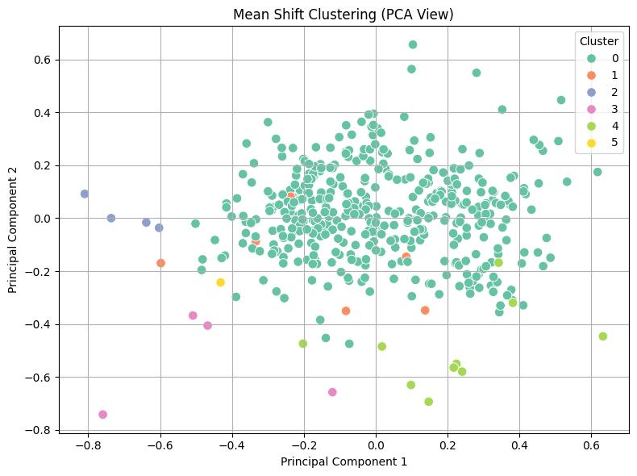

# Clustering Assignment – UCI Wholesale Customers Dataset

This project explores the performance of three unsupervised clustering algorithms applied on the Wholesale Customers dataset from the UCI Machine Learning Repository. The study evaluates how preprocessing techniques and number of clusters affect clustering quality.

---

## 📊 Dataset
- **Source**: [Wholesale Customers Data Set – UCI ML Repository](https://archive.ics.uci.edu/ml/datasets/Wholesale+customers)
- **Features Used**: Fresh, Milk, Grocery, Frozen, Detergents_Paper, Delicassen
- **Samples**: 440

---

## 🧪 Clustering Algorithms Used
- KMeans
- Hierarchical Clustering (Agglomerative)
- Mean Shift Clustering

---

## ⚙️ Preprocessing Techniques
- No Processing
- Normalization
- Log Transformation
- PCA (Dimensionality Reduction)
- T+N (Log Transform + Normalization)
- T+N+PCA

---

## 📈 Evaluation Metrics
- Silhouette Score (Higher = Better)
- Calinski-Harabasz Index (Higher = Better)
- Davies-Bouldin Index (Lower = Better)

---

## 🔍 Visualizations

### KMeans (k=3, best result)

### Hierarchical Clustering (k=3)

### Mean Shift Clustering (auto-detected clusters)

---

## ✅ Results Summary

| Algorithm           | Best Preprocessing | Best k  | Silhouette | CH Score | DB Score |
|---------------------|--------------------|--------|------------|----------|----------|
| KMeans              | PCA                | 3      | **0.5229** | 285.49   | 0.75     |
| Hierarchical        | PCA                | 3      | 0.5252     | 245.35   | 0.73     |
| Mean Shift          | PCA                | auto   | 0.4897     | 100.66   | 0.48     |

---

## 📌 Conclusion

- **KMeans with PCA and k=3** gave the best clustering performance visually and numerically.
- Mean Shift detected more clusters but lacked meaningful separation.
- PCA significantly improved the separation and interpretability of clusters across all methods.

