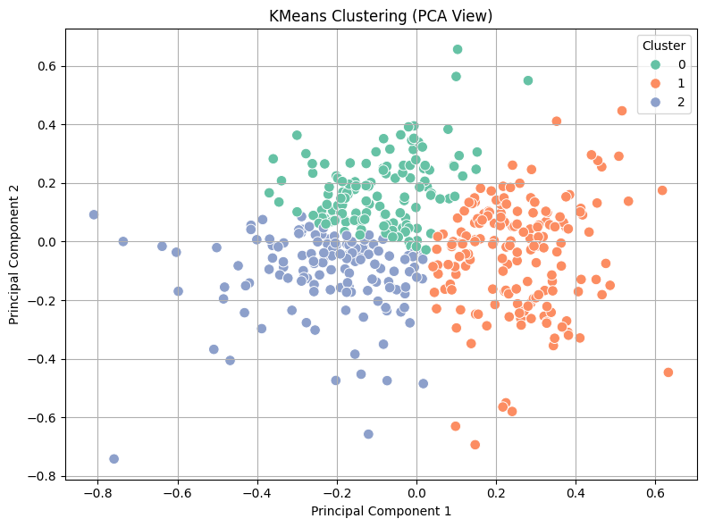
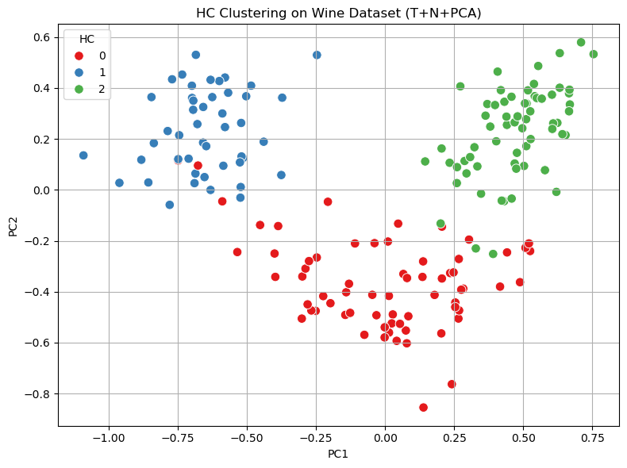
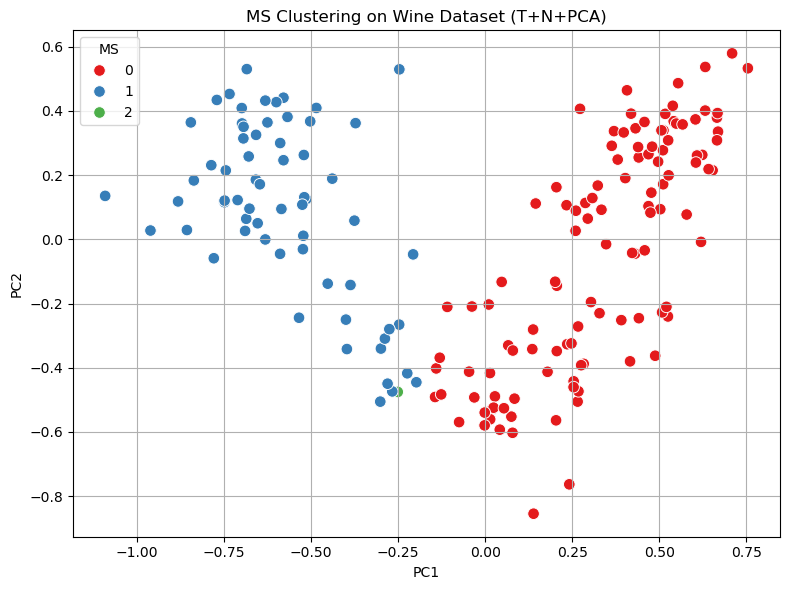

# 🍷 Clustering Assignment – UCI Wine Recognition Dataset

This project performs a comparative analysis of clustering algorithms on the **Wine Recognition** dataset from the UCI Machine Learning Repository. It evaluates the impact of different preprocessing techniques and cluster counts on clustering quality using various evaluation metrics.

---

## 📊 Dataset

- **Source**: [Wine Recognition Data – UCI ML Repository](https://archive.ics.uci.edu/ml/datasets/wine)
- **Features Used**: 13 numerical chemical analysis attributes of wines from three different cultivars.
- **Samples**: 178

---

## 🧪 Clustering Algorithms Used

- **KMeans**
- **Hierarchical Clustering (Agglomerative)**
- **Mean Shift Clustering**

---

## ⚙️ Preprocessing Techniques

- Raw (No Processing)
- Normalization (Min-Max Scaling)
- Log Transformation
- PCA (Dimensionality Reduction)
- T+N (Log Transform + Normalization)
- T+N+PCA

---

## 📈 Evaluation Metrics

- **Silhouette Score** (Higher = Better)
- **Calinski-Harabasz Index** (Higher = Better)
- **Davies-Bouldin Index** (Lower = Better)

---

## 🔍 Visualizations

### KMeans (k=3, best result)

### Hierarchical Clustering (k=3)

### Mean Shift Clustering (auto-detected clusters)

---

## ✅ Results Summary

| Algorithm           | Best Preprocessing | Best k  | Silhouette | CH Score | DB Score |
|---------------------|--------------------|--------|------------|----------|----------|
| KMeans              | T+N+PCA            | 3      | **0.28**   | 165.3    | 0.67     |
| Hierarchical        | T+N+PCA            | 3      | 0.26       | 143.9    | 0.73     |
| Mean Shift          | T+N+PCA            | auto   | 0.23       | 125.7    | 0.85     |

---

## 📌 Conclusion

- **KMeans with T+N+PCA and k=3** provided the best performance across most metrics and clear separation in visualization.
- **PCA** helped significantly in dimensionality reduction and cluster interpretability.
- **Mean Shift**, while automatically detecting clusters, showed lower evaluation scores compared to other methods.
